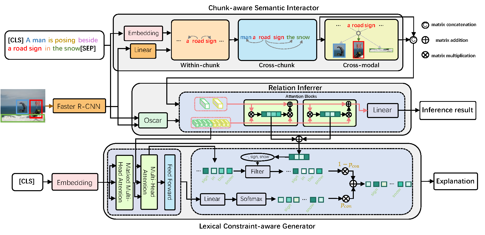

# Chunk-aware Alignment and Lexical Constraint for Visual Entailment with Natural Language Explanations

## Introduction

This repository contains source code necessary to reproduce the results presented in the paper [Chunk-aware Alignment and Lexical Constraint for Visual Entailment with Natural Language Explanations](https://arxiv.org/abs/2207.11401).
We propose a unified Chunk-aware Alignment and Lexical Constraint based method, dubbed as CALeC for Visual Entailment with Natural Language Explanations. For more details, please refer to the paper.
We conduct extensive experiments on three datasets, and experimental results indicate that CALeC significantly outperforms other competitor models on inference accuracy and quality of generated explanations.



## Training procedure

We conduct experiments on three datasets: VQA-X, e-SNLI-VE and VCR. These datasets can be downloaded from [e-vil](https://github.com/maximek3/e-ViL).
Our model is based on [Oscar-base-image-captioning](https://github.com/microsoft/Oscar/blob/master/VinVL_DOWNLOAD.md) and [GPT-2-base](https://huggingface.co/gpt2), please download these models and change the ``model_name_or_path``, `seq_model_name_or_path` and `gpt_model_name_or_path` to your path.

### Image feature extraction
We extract the image features using [VilVL](https://github.com/pzzhang/VinVL) and save them into *pkl* file.
The *pkl* file is organized as a dictionary:  `{image_id : {'image_feat': image_feat}}`

### Get Chunk Border
We utilize [Adapter](https://huggingface.co/AdapterHub/bert-base-uncased-pf-conll2000) to get the borders of each chunk of the input text.
You may install adapter-transformers and run:

```
python ./utils/GetChunk_v4_SNLI.py 
```
The border index will be saved as a dictionary in *pkl* file.

### CSI Pretraining
Here is an example to pre-train CSI on Flickr30k:

```
python CSI_prertain_align_only.py --do_train --do_lower_case --save_steps 1000 --output_dir ./outputs/CSI_pre_train
```

You canfind the pre-trained CSI on from the [Google Drive](https://drive.google.com/drive/folders/1b0dUHWwFvn7zCziAn9BriHdLwiJTeDS9?usp=sharing).

### Training

We train encoder and decoder separately, we give an example to train the model on e-SNLI-VE as follow:
```
python run_SNLI_CALEC_cls_only.py --do_train --do_lower_case --save_steps 1000 --output_dir ./outputs/SNLI_cls_only

```

You will need [cococaption](https://github.com/tylin/coco-caption) and the annotations in the correct format in order to perform evaluation on NLG metrics.
Note that PTBTokenizer in [cococaption](https://github.com/tylin/coco-caption) will affect the NLG score.


```
python run_SNLI_CALEC.py --do_train --do_lower_case --save_steps 1000 --enc_pretrain_model_dir path_to_encoder --output_dir ./outputs/SNLI 
```

The checkpoints will be saved in the output_dir.
You can run the code of ablation study ,e.g.,  `run_SNLI_CALEC_wo_LECG.py`, in a similar way. 

The training procedure of VQA-X and VCR is similar to e-SNLI-VE.

## Testing

Here is an example to run a trained model on the e-SNLI-VE test set using constrained beam sample:

```
python run_SNLI_CALEC_CBS.py --do_test --do_lower_case --eval_model_dir path_to_ckpt --constrained 0.86
```

The --constrained is the constrained coefficient used in constrained beam sample.
All generated explanations and a text log will be saved in the given output directory (*path_to_ckpt*).

The testing procedure of VQA-X and VCR is similar to e-SNLI-VE.

## Results

Follow [e-ViL](https://github.com/maximek3/e-ViL), we test our model CALeC on e-SNLI-VE, VQA-X and VCR. Please refer to the benchmark repository for the datasets detail.
The output results (generated text) on the test dataset can be downloaded from the [Google Drive](https://drive.google.com/drive/folders/1WbSKPSft_f-YF0OJBcDB5c8yhwm889oR?usp=share_link).
Please note that the results in the paper may not identically correspond to the results in the links above. We have trained several models and randomly picked one for presenting the qualitative results.


## Framework versions

* Pytorch 1.7.1+cu110
* Transformers 4.18.0

## Citations

Please consider citing this paper if you use the code:


```
@inproceedings{yang2022chunk,
  title={Chunk-aware Alignment and Lexical Constraint for Visual Entailment with Natural Language Explanations},
  author={Yang, Qian and Li, Yunxin and Hu, Baotian and Ma, Lin and Ding, Yuxin and Zhang, Min},
  booktitle={Proceedings of the 30th ACM International Conference on Multimedia},
  pages={3587--3597},
  year={2022}
}

```
